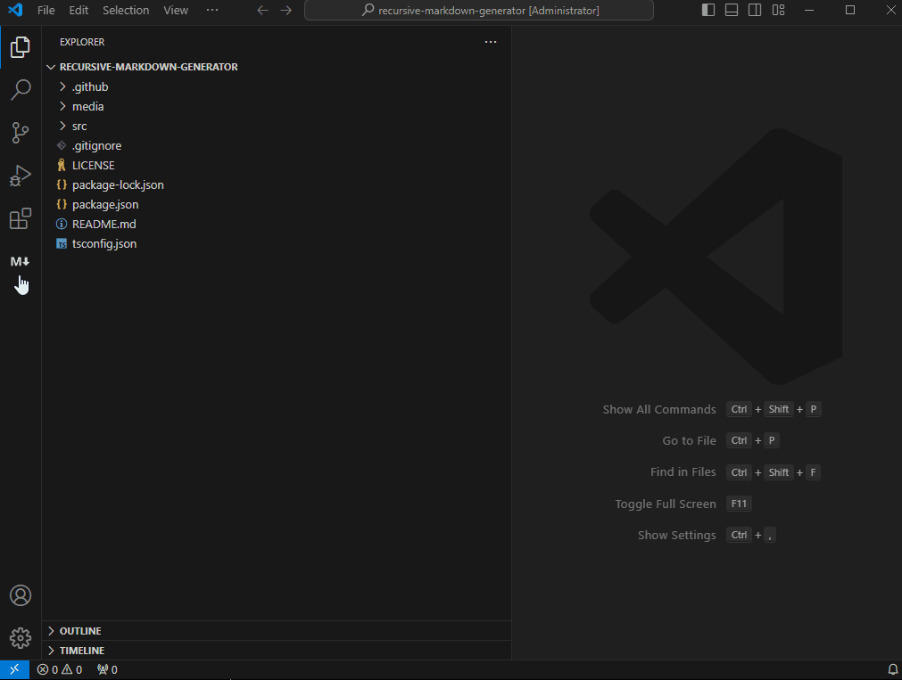

# Recursive Markdown Generator

Recursively generate markdown from files in the current directory.

## Features

- Generates a markdown file containing the content of all files in the current workspace
- Ignores binary files and respects .gitignore patterns
- Provides a webview for previewing the generated markdown
- Allows downloading the generated markdown

## Usage

1. Open the Recursive Markdown Generator view in the Activity Bar
2. Click the "Generate Recursive Markdown" button or run the command "Generate Recursive Markdown"
3. Preview the generated markdown in the webview
4. Click the "Download Markdown" button to save the generated markdown to a file

## Extension Settings

This extension contributes the following settings:

- `recursiveMarkdownGenerator.ignorePatterns`: Patterns to ignore when generating markdown
- `recursiveMarkdownGenerator.ignoreFiles`: Files containing ignore patterns (e.g., .gitignore)

## Known Issues

Please report any issues on the GitHub repository.

## Release Notes

### 0.0.1

Initial release of Recursive Markdown Generator
